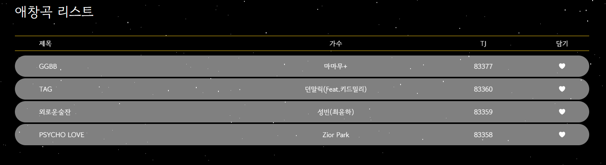

# SSAFY 8기 A603 특화 프로젝트

# ToneMate

# 프로젝트 개요

1. ToneMate는 웹 페이지를 통해 사용자의 음색과 음역대를 분석하고, 이에 맞는 최적의 노래를 추천하는 프로젝트입니다. 
2. 이 프로젝트의 목적은 사용자가 자신과 가장 어울리는 가수와 노래를 추천받을 수 있도록 하는 것입니다.

# 프로젝트 구성원

- Front-End : **권영진(팀장)**, 윤준하
- Back-End / Data : 이상현, 박수민
- Back-End / AI : 류정민, 박정희

# 맡은 역할

- 권영진 : 음색, 음역대 검사, 노래 검색, 애창곡 리스트 레이아웃, 웹앱 반응형 구현, 발표, 프로젝트 매니저
- 윤준하 : UI 작성, API 핸들러 작성, 서비스 로직 작성
- 이상현 : 노래방 기능, 애창곡 기능, 데이터 수집, MapReduce를 통한 데이터 처리
- 박수민 : 노래방 기능, 애창곡 기능, 소셜 로그인, JWT
- 류정민 : 음색, 음역대 분석 REST API, AI 모델 선정 및 학습
- 박정희 : 음색, 음역대 분석 REST API, AI 모델 선정 및 학습, CI/CD

# 사용된 기술

펼쳐보기

    
    ### Front End
    
    - React 18.2.0
    - Next.js 13.2.4
    - Tanstack Query 4.28.0
    - Axios 1.3.4
    - Chart.js 4.2.1
    
    ### Back-end
    
    - Java openjdk-11
    - Python 3.10.9
    - Spring boot 2.7.5
    - Spring Security 5.7.4
    - Spring Data JPA 2.7.5
    - Querydsl 5.0.0
    - JWT 0.11.5
    - Spring Data Redis 2.7.5
    - Flask 2.2.3
    
    ### AI
    
    - scikit-learn 1.2.2
    - Keras 2.11.0
    - librosa 0.10.0
    - tensorflow 2.11.0
    
    ### Data
    
    - Hadoop-MapReduce 3.3.1
    - MRjob 0.7.4
    
    ### CI / CD
    
    - GitLab, Jenkins

# ERD

펼쳐보기

# 모델 구조

  
v1

  
  

    

  
v2

  
  

    
- 모델 학습 방법:
    - 최적화 알고리즘: Adam
    - 학습률(learning rate): 0.001
    - 손실 함수(loss function): categorical_crossentropy
    - 정확도 측정 지표(metrics): accuracy
    - 배치 크기(batch size): 32
    - 에폭(epoch): 60(v1), 40(v2)
    

# 결과

모델 시각화

- v1

- v2

# 기능

 펼쳐보기 

# REST API

펼쳐보기

# 웹 페이지 설명

펼쳐보기

## 로그인 - 카카오 소셜 로그인

- Spring Security, JWT를 이용하여 구현
- JWT의 경우 httponly, samesite는 Lax로 설정한 쿠키에 저장
- Refresh Token과 Access Token을 이용하여 이용자의 UX 고려
- Access Token은 30분, Refresh Token은 7일로 설정

## 메인 페이지

- 좌측 네비게이션 바 설정
- Spring Security로 로그아웃 구현
- 로그아웃 버튼으로 JWT 쿠키를 삭제하여 로그아웃 처리

## 음색 검사

- 녹음 시작 버튼 클릭 -> 녹음 완료 버튼 클릭 -> 검사 제출
- Spring 서버를 거쳐 Flask 서버를 통해 AI 분석 후 결과를 저장하고 Front에 알맞은 형태로 응답

- 녹음이 시작되면 오디오 비주얼라이저가 실행되는 것을 볼 수 있음

- 결과가 전달되면 결과 페이지가 보임
- chart.js를 이용하여 그래프를 표현
- 대표 노래들의 유튜브 검색 링크를 제공하여 유저가 편하게 검색할 수 있도록 함

## 음역대 검사

- 최고음 측정 -> 최고음 종료 -> 최저음 측정 -> 최저음 종료 -> 검사 제출
- 녹음이 시작되면 오디오 비주얼라이저가 실행되는 것을 볼 수 있음

- Spring boot에서 tarsos 라이브러리를 통해 음역대를 판단함
- 이에 맞는 노래 목록들을 DB에서 검색하여 응답함

## 검사 결과

- 지난 검사 결과들을 보여줌

## 노래 검색

- TJ노래방 번호들을 크롤링하여 DB 구성
- JPA의 페이지네이션 기능 사용
- 로그인 한 유저의 애창곡 리스트에 해당 곡의 유무도 같이 응답함
- 검색 속도 향상을 위해 가수와 제목의 띄어쓰기를 전부 제거한 컬럼을 생성하고, 인덱싱 처리를 함

## 애창곡 리스트

- 로그인 한 유저의 애창곡 리스트 제공
- JPA의 페이지네이션 기능 사용

# 서비스 아키텍처

# 데이터셋

- AI hub - 보컬파일
- 한국 가수 100명의 노래 약 5000곡

# 사용 방법
[실행 방법](exec/README.md)

# 참고 문헌

- 하둡 완벽 가이드 - 톰 화이트
- 자바 ORM 표준 JPA 프로그래밍 - 김영한
- React를 다루는 기술 - 김민준
- Spring Security, Hadoop MapReduce, Next.js, React, tailwindCSS - 공식 문서
