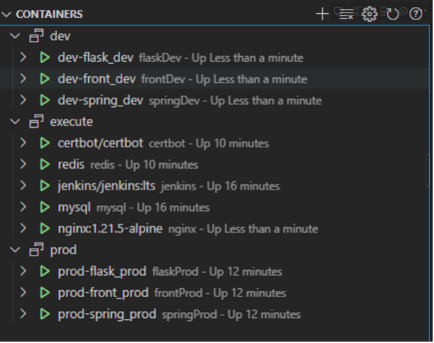

# 포팅 매뉴얼

# ToneMate 포팅 메뉴얼

## 목차

1. 배포 환경
2. 사전 준비 
3. 실행 방법
4. 주의 사항
5. 기술 스택

## 1. 배포 환경

- 하드웨어 정보
    - Architecture: x86_64
    - CPU Model: Intel(R) Xeon(R) CPU E5-2686 v4 @ 2.30GHz
    - CPU family: 6
    - CPU op-mode(s): 32-bit, 64-bit
    - Socket(s): 1
    - Core(s) per socket: 4
    - Thread(s) per core: 1
    - CPU(s): 4
    - CPU MHz: 2300.167
- 소프트웨어 정보
    - OS : Ubuntu 20.04 LTS focal
    - 배포에 필요한 프로그램 : Docker version 20.10.12, build 20.10.12-0ubuntu2~20.04.1
    - 패키지 관리자 : apt 2.0.2ubuntu0.2 (amd64)

## 2. 사전 준비

필요한 준비는 다음과 같습니다.

1. **AI 데이터(wav파일), 음색에 따른 가수 유사도 예측 모델 준비**
    1. 필요한 데이터 수집
        
        ```
        데이터폴더_mp3
        ├── 가수1
        │   └── 가수1 - 노래이름1.mp3
        │   └── 가수1 - 노래이름2.mp3
        ├── 가수2
        │   └── 가수2 - 노래이름3.mp3
        │   └── 가수2 - 노래이름4.mp3
        .....
        ```
        
    2. 데이터 전처리
        
        ```
        데이터폴더_wav
        ├── 가수1
        │   └── 가수1 - 노래이름1.wav
        │   └── 가수1 - 노래이름2.wav
        ├── 가수2
        │   └── 가수2 - 노래이름3.wav
        │   └── 가수2 - 노래이름4.wav
        .....
        ```
        
    3. 데이터 전처리(선택사항)
        
        ```
        # AI/LSTM모델.ipynb
        
        # 1. 최초 1번 실행하여야 함
        X, y = PROCESSING.createDATA("데이터폴더_wav",SR,20,True,True,True,True,True)
        
        --------------------------------------------------------------------------------
        # 2. 최초 실행 이후 생성된 numpy파일로 빠르게 데이터 불러오기
        X = []
        y = []
        for root, dirs, files in os.walk("데이터폴더_numpy"):
            for file in files:
                if file.endswith(".npy"):
                    label = file.split(" - ")
                    singer = label[0]
                    title = label[1][:-4]
                    path = os.path.join(root, file) 
                    data = np.load(path)
                    if(data.shape[0]==36 and data.shape[1]==3000):
                        X.append(data)
                        y.append(singer)
        X = np.stack(X)
        y = np.array(y)
        if not os.path.exists(TENSER_PATH):
            os.makedirs(TENSER_PATH)
        
        np.save(f'{TENSER_PATH}/X.npy', X) # 이후 저장된 파일로 한번에 X불러오기
        np.save(f'{TENSER_PATH}/y.npy', y) # 이후 저장된 파일로 한번에 Y불러오기
        ```
        
    4. 최종 DATA볼륨 형태
        
        ```
        DATA
        ├── checkpoint //학습모델 형태에 따라 버전 구분
        │   ├── V1
        │   │   └── MFCC20_ALL //데이터가 가진 특성들에 따라 작명
        │   │       └── checkpoint60.h5  //EPOCH 횟수기입
        │   └── V2
        │       └── MFCC20_ALL 
        │           └── checkpoint40.h5 
        ├── dev.env //개발 branch 8080포트에서 실행되는 서비스에 대한 환경변수
        ├── prod.env //배포 branch 8080포트에서 실행되는 서비스에 대한 환경변수
        └── tensor 
            └── MFCC20_ALL //모델학습에 사용한 데이터
                ├── X.npy
                ├── init.sql
                ├── mean_g_mean_by_col.npy
                ├── mean_g_std_by_col.npy
                ├── var_g_mean_by_col.npy
                ├── var_g_std_by_col.npy
                └── y.npy
        ```
        
2. **Docker, Docker Compose 설치 및 네트워크, volume 설정**
    1. execute/init-letsencrypt.sh 파일 수정 및 실행
        
        ```
        
        .....
        domains=자신이 준비한 도메인
        email=자신의 이메일
        ......
        ```
        
    2. 프로젝트.env 환경변수 값 수정
        배포용, 개발용 버전의 env 파일이 필요합니다. AI_DATA 볼륨으로 지정했던 DATA에 다음 형식을 지킨 .env파일을 생성합니다.
        ```
        #스프링
        DB_URL="MYSQL URL"
        DB_USER="DB 사용자 정보"
        DB_PASSWORD="DB 비밀번호"
        BUCKET_NAME="S3 버킷이름"
        AWS_SECRET_KEY="S3의 AWS 시크릿 키"
        AWS_ACCESS_KEY="S3의 접근 키"
        KAKAO_SECRET="카카오 REST API 키"
        KAKAO_ID="카카오 개발자 식별코드"
        GOOGLE_SECRET="구글 시크릿 키"
        GOOGLE_ID="구글 식별코드"
        JWT_SECRET="암호화된 JWT 시크릿키 코드"
        REDIS_HOST="레디스 호스트"
        REDIS_PASSWORD="레디스 비밀번호"
        KAKAO_REDIRECT_URI="카카오 리다이렉션 주소"
        GOOGLE_REDIRECT_URI="구글 리다이렉션 주소"
        FLASK_DOMAIN=http://flaskDev:5000 # 고정
        
        #플라스크
        FLASK_FEATURES="모델 학습데이터 특징"
        FLASK_TARGET_EPOCH="숫자(몇번째 모델을 쓸지 지정)"
        FLASK_MODEL_VERSION="모델 버전 ex) V1"
        ```
        위와같은 형식으로 dev.env , prod.env 파일을 생성합니다.
        각각의 파일은 develop 브랜치와 master 브랜치의 실행 환경변수파일 입니다.
        


## 3. 컨테이너 실행( execute)

전체 서비스를 실행시키는 순서는 다음과 같습니다.

1. Jenkins, Mysql, Redis 실행
    1. 필요한 데이터 수집
        
        ```
        # /execute에서 진행
        $ docker-compose up -d jenkins mysql redis
        ```
        
2. 배포, 개발용 컨테이너 실행
    
    젠킨스 설정을 통해 실행합니다. (뒤에서 설명) 
    WebHook을 사용하여 자동 빌드 및 배포 설정을 합니다. 젠킨스의 기본 플러그 및 gitLab을 설치한 후,  빌드 설정에서 “지금 빌드” 를 눌러서 Execute Shell에 작성한 순서로 명령어가 수행합니다.
    
    ```
    # 개발 서비스용 shell
    echo "NEXT_PUBLIC_API_URL=https://j8a603.p.ssafy.io:8080/api" > front-end/tonemate/.env.production
    cp /var/DATA/dev.env dev.env
    docker-compose -f docker-compose-develop.yml --env-file=dev.env down
    docker-compose -f docker-compose-develop.yml --env-file=dev.env build
    docker-compose -f docker-compose-develop.yml --env-file=dev.env up -d
    docker restart nginx
    
    docker exec nginx sh -c "nginx -c /etc/nginx/nginx-prod.conf -s reload"
    ```
    
    ```
    # 배포 서비스용 shell
    docker exec nginx sh -c "nginx -c /etc/nginx/nginx-dev.conf -s reload"
    cp /var/DATA/prod.env prod.env
    docker-compose -f docker-compose-production.yml --env-file=prod.env down
    docker-compose -f docker-compose-production.yml --env-file=prod.env build
    docker-compose -f docker-compose-production.yml --env-file=prod.env up -d
    docker restart nginx 
    docker exec nginx sh -c "nginx -c /etc/nginx/nginx-prod.conf -s reload"
    ```
    
3. nginx, certbot 실행
    
    ```
    # /execute에서 진행
    $ docker-compose up -d
    ```
    
  
    

## 4. 주의 사항

1. docker, docker-compose는 아키텍처, 운영체제 등에 따라 설치 코드가 다를 수 있으니 적절한 버전을 선택하세요.

2. 기본적으로 도커를 실행하려면 root계정 권한이 필요합니다. 일반 계정에서 도커를 사용하고자 한다면 도커를 사용할 수 있는 그룹에 사용자를 추가해야 합니다. 그룹에 사용자를 추가하고자 한다면 다음 명령어를 입력합니다.

```
$ sudo usermod -aG docker 유저계정
```

도커 설정 등에 의해서 Permission definded 에러가 나온다면 다음 명령어를 프로젝트에 적용하세요.

```
$ chown -R 사용자계정 프로젝트root폴더
```

1. mysql은 JPA로 테이블이 자동생성됩니다. 더미 데이터를 활용하고자 한다면 /execute/mysql/mysql-init-files폴더에 sql파일을 넣습니다.
이후 mysql 컨테이너에서 sql문을 실행합니다.
/exec/init.sql은 개발과정에 사용된 백업 데이터베이스 파일입니다.

## 5. 기술 스택

### Front End

- React 18.2.0
- Next.js 13.2.4
- Tanstack Query 4.28.0
- Axios 1.3.4
- Chart.js 4.2.1

### Back-end

- Java openjdk-11
- Python 3.10.9
- Spring boot 2.7.5
- Spring Security 5.7.4
- Spring Data JPA 2.7.5
- Querydsl 5.0.0
- JWT 0.11.5
- Spring Data Redis 2.7.5
- Flask 2.2.3

### AI

- scikit-learn 1.2.2
- Keras 2.11.0
- librosa 0.10.0
- tensorflow 2.11.0

### Data

- Hadoop-MapReduce 3.3.1
- MRjob 0.7.4

### CI / CD

- GitLab, Jenkins
